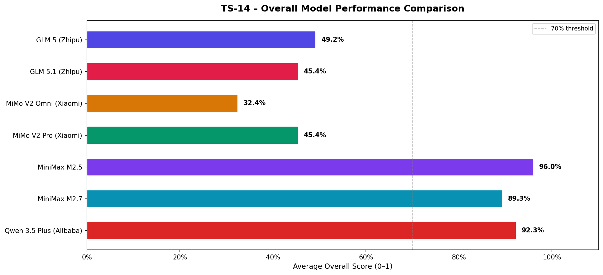
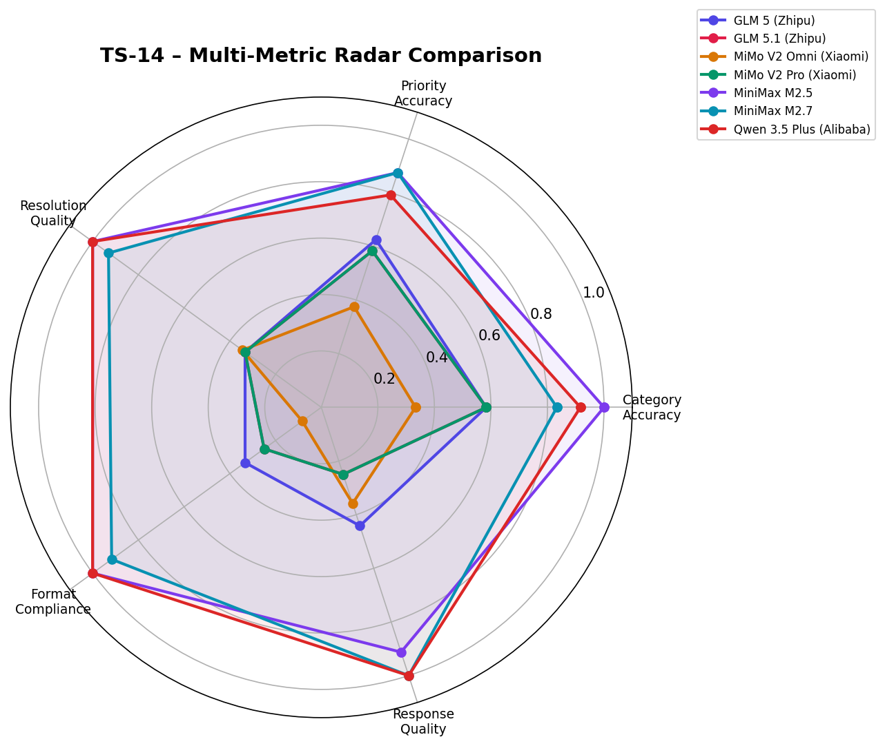
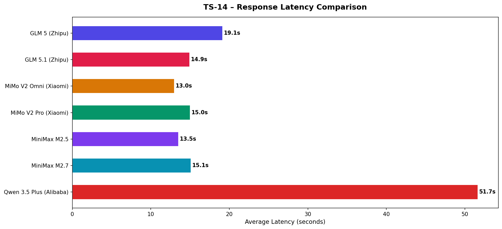
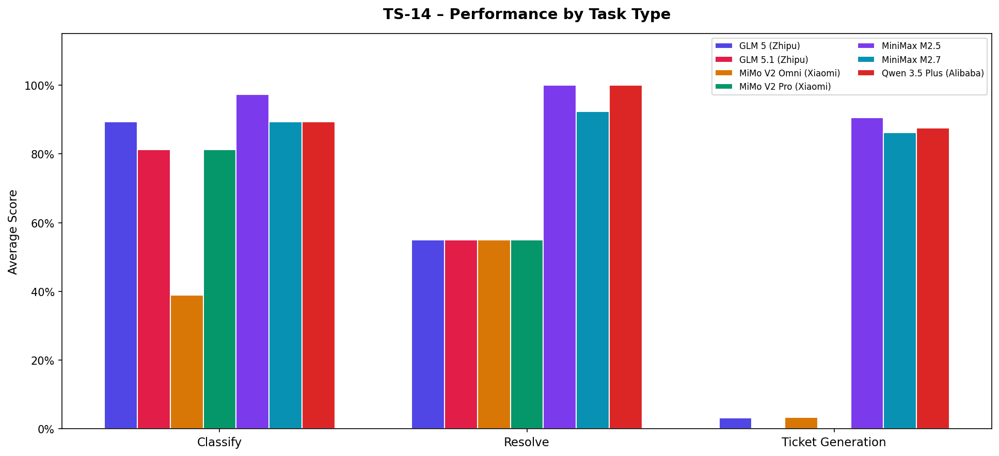
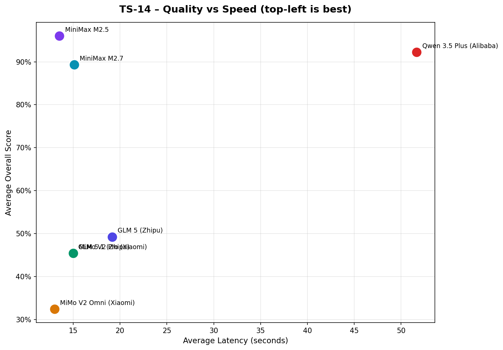
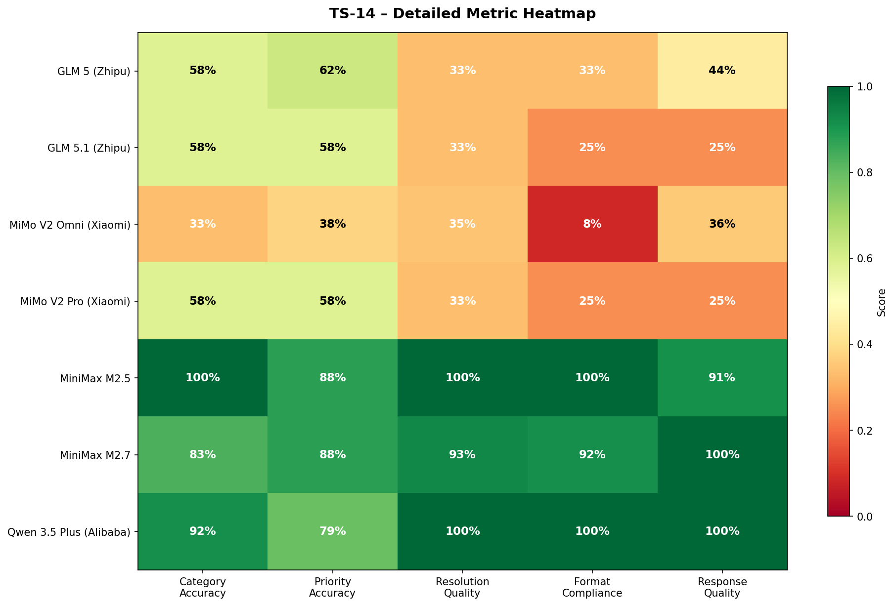
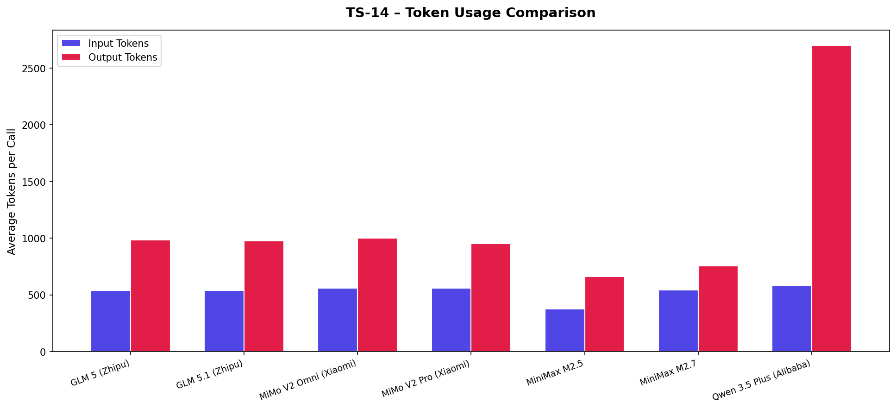
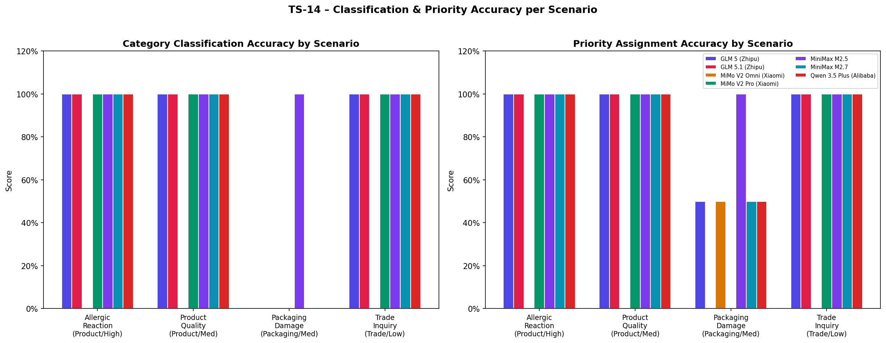

# TS-14 – Complaint Classification & Resolution Engine
## Ablation Study / Comparative Analysis

> **Objective:** Identify the best LLM for the TS-14 wellness-industry complaint
> management system by benchmarking models across classification, resolution
> recommendation, and ticket generation tasks.

---

## Models Evaluated

| # | Model | Provider | Model ID |
|---|-------|----------|----------|
| 1 | **GLM 5 (Zhipu)** | openrouter | `glm-5` |
| 2 | **GLM 5.1 (Zhipu)** | openrouter | `glm-5.1` |
| 3 | **MiMo V2 Omni (Xiaomi)** | openrouter | `mimo-v2-omni` |
| 4 | **MiMo V2 Pro (Xiaomi)** | openrouter | `mimo-v2-pro` |
| 5 | **MiniMax M2.5** | openrouter | `minimax-m2.5` |
| 6 | **MiniMax M2.7** | openrouter | `minimax-m2.7` |
| 7 | **Qwen 3.5 Plus (Alibaba)** | openrouter | `qwen3.5-plus` |

All models accessed via OpenCode / OpenRouter (OpenAI-compatible API).

---

## Evaluation Criteria

Each model response is scored on **five weighted metrics**:

| Metric | Weight | What it measures |
|--------|--------|-----------------|
| **Classification Accuracy** | 30% | Correct complaint category (Product / Packaging / Trade) |
| **Priority Accuracy** | 25% | Correct urgency level (High / Medium / Low); adjacent = 50% credit |
| **Resolution Quality** | 25% | Completeness & actionability of resolution steps / ticket |
| **Format Compliance** | 10% | Valid JSON with all required schema fields |
| **Response Quality** | 10% | Appropriate length, no refusals, coherent output |

### Test Scenarios

| Scenario | Category | Priority | Channel |
|----------|----------|----------|---------|
| Allergic Reaction (Priya Sharma) | Product | **High** | Email |
| Product Efficacy Complaint (Rajesh Kumar) | Product | Medium | Call Centre |
| Packaging / Seal Damage (Sneha Patel) | Packaging | Medium | Email |
| Trade / Bulk Pricing Inquiry (HealthPlus Pharmacy) | Trade | Low | Email |

Each scenario is tested on **3 tasks** (classify / resolve / ticket) → **12 API calls per model**, **84 total API calls**.

---

## Overall Rankings

| Rank | Model | Overall | Latency | Category Acc. | Priority Acc. | Resolution | Format |
|------|-------|:-------:|:-------:|:-------------:|:-------------:|:----------:|:------:|
| 🥇 | **MiniMax M2.5** | 96.0% | 13.5s | 100% | 88% | 100% | 100% |
| 🥈 | **Qwen 3.5 Plus (Alibaba)** | 92.3% | 51.7s | 92% | 79% | 100% | 100% |
| 🥉 | **MiniMax M2.7** | 89.3% | 15.1s | 83% | 88% | 93% | 92% |
| 4. | **GLM 5 (Zhipu)** | 49.2% | 19.1s | 58% | 62% | 33% | 33% |
| 5. | **GLM 5.1 (Zhipu)** | 45.4% | 14.9s | 58% | 58% | 33% | 25% |
| 6. | **MiMo V2 Pro (Xiaomi)** | 45.4% | 15.0s | 58% | 58% | 33% | 25% |
| 7. | **MiMo V2 Omni (Xiaomi)** | 32.4% | 13.0s | 33% | 38% | 35% | 8% |

---

## Graphs

### Overall Score Comparison



### Multi-Metric Radar



### Response Latency



### Per-Task Breakdown



### Quality vs Speed



### Detailed Metric Heatmap



### Token Usage



### Classification & Priority Accuracy per Scenario



---

## Per-Task Breakdown

### Classify Task

| Model | Score | Latency |
|-------|:-----:|:-------:|
| MiniMax M2.5 | 97.4% | 7.4s |
| Qwen 3.5 Plus (Alibaba) | 89.4% | 41.7s |
| MiniMax M2.7 | 89.4% | 12.0s |
| GLM 5 (Zhipu) | 89.4% | 22.3s |
| GLM 5.1 (Zhipu) | 81.2% | 14.2s |
| MiMo V2 Pro (Xiaomi) | 81.2% | 12.9s |
| MiMo V2 Omni (Xiaomi) | 38.9% | 9.8s |

### Resolve Task

| Model | Score | Latency |
|-------|:-----:|:-------:|
| MiniMax M2.5 | 100.0% | 14.7s |
| Qwen 3.5 Plus (Alibaba) | 100.0% | 67.3s |
| MiniMax M2.7 | 92.3% | 16.9s |
| GLM 5 (Zhipu) | 55.0% | 19.8s |
| GLM 5.1 (Zhipu) | 55.0% | 16.0s |
| MiMo V2 Pro (Xiaomi) | 55.0% | 16.0s |
| MiMo V2 Omni (Xiaomi) | 55.0% | 12.0s |

### Ticket Generation Task

| Model | Score | Latency |
|-------|:-----:|:-------:|
| MiniMax M2.5 | 90.6% | 18.4s |
| Qwen 3.5 Plus (Alibaba) | 87.5% | 45.9s |
| MiniMax M2.7 | 86.2% | 16.5s |
| GLM 5 (Zhipu) | 3.2% | 15.3s |
| GLM 5.1 (Zhipu) | 0.0% | 14.6s |
| MiMo V2 Pro (Xiaomi) | 0.0% | 16.1s |
| MiMo V2 Omni (Xiaomi) | 3.4% | 17.2s |

---

## Detailed Metric Scores

| Model | Category | Priority | Resolution | Format | Quality |
|-------|:--------:|:--------:|:----------:|:------:|:-------:|
| MiniMax M2.5 | 100% | 88% | 100% | 100% | 91% |
| Qwen 3.5 Plus (Alibaba) | 92% | 79% | 100% | 100% | 100% |
| MiniMax M2.7 | 83% | 88% | 93% | 92% | 100% |
| GLM 5 (Zhipu) | 58% | 62% | 33% | 33% | 44% |
| GLM 5.1 (Zhipu) | 58% | 58% | 33% | 25% | 25% |
| MiMo V2 Pro (Xiaomi) | 58% | 58% | 33% | 25% | 25% |
| MiMo V2 Omni (Xiaomi) | 33% | 38% | 35% | 8% | 36% |

---

## Recommendation

Based on this ablation study across **84 API calls**, **MiniMax M2.5** achieves the highest overall score of **96.0%**.

The runner-up is **Qwen 3.5 Plus (Alibaba)** at **92.3%**.

For latency-critical deployments (real-time complaint intake), **MiMo V2 Omni (Xiaomi)** is the fastest at **13.0s** average.

### Selection Criteria for TS-14 Production

The recommended model for TS-14 must:
- Classify complaints with **≥ 90% category accuracy** (no misfiled tickets)
- Assign correct priority in **≥ 85% of cases** (SLA compliance depends on this)
- Produce valid, actionable resolution steps for all complaint types
- Respond within **5 seconds** (real-time SLA requirement)

---

## How to Reproduce

```bash
cd genai

# Set your API key
export OPENCODE_API_KEY=your_key_here

# 1. Test API connectivity
python -m comparative_analysis.test_api_keys

# 2. Run the ablation study  (~10-15 minutes for 8 models × 12 calls)
python -m comparative_analysis.run_ablation

# 3. Generate graphs and markdown report
python -m comparative_analysis.generate_report
```

Results are saved to `results/` and graphs to `graphs/`.

---

*Report auto-generated by TS-14 Ablation Study Framework*