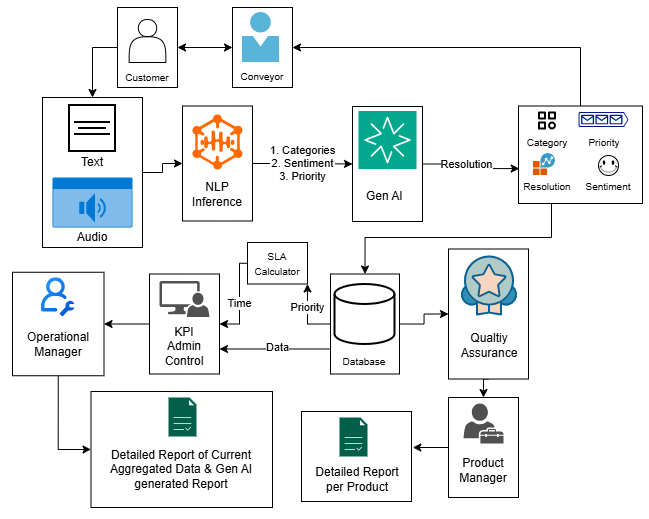

# Lakshya LDCE — AI-Powered Voice Complaint Management System

> **TS-14: AI-Powered Complaint Classification & Resolution Recommendation Engine**
> Built for Lakshya 2.0, LDCE Hackathon

A production-grade, multi-layer AI system that ingests customer complaints via voice, text, or web — classifies them with ONNX-accelerated NLP, generates empathetic resolution plans with LLMs, and persists everything to a role-based dashboard with SLA tracking.

---

## Table of Contents

- [System Architecture](#system-architecture)
- [Layer 1 — GenAI Resolution Engine](#layer-1--genai-resolution-engine)
- [Layer 2 — NLP Text Classifier](#layer-2--nlp-text-classifier)
- [Layer 3 — Speech-to-Text (STT)](#layer-3--speech-to-text-stt)
- [Layer 4 — Voice Agent Orchestrator](#layer-4--voice-agent-orchestrator)
- [Layer 5 — Website Backend & Dashboard](#layer-5--website-backend--dashboard)
- [End-to-End Data Flow](#end-to-end-data-flow)
- [Quick Start](#quick-start)
- [Deployment Modes](#deployment-modes)
- [Resource Requirements](#resource-requirements)

---

## System Architecture

```
                              USER
                               │
              ┌────────────────┼────────────────┐
              │                │                │
         PHONE CALL        WEB FORM         WALK-IN
              │                │                │
              ▼                ▼                ▼
  ┌───────────────────┐  ┌─────────────────────────────┐
  │   TWILIO          │  │   WEBSITE (Next.js :3000)    │
  │   Media Stream    │  │   • Landing page             │
  │   WebSocket PCM16 │  │   • Role-based dashboard     │
  └────────┬──────────┘  │   • Complaint intake API     │
           │             │   • SSE real-time updates     │
           ▼             │   • Supabase/PostgreSQL       │
  ┌───────────────────┐  └──────────────┬──────────────┘
  │  ORCHESTRATOR     │                 │
  │  (:8003)          │                 │
  │                   │                 │
  │  • FSM State Mgmt │                 │
  │  • Agent Router   │                 │
  │  • LLM: Ollama↔Groq│                 │
  │  • TTS: Piper↔Edge│                 │
  └────────┬──────────┘                 │
           │                            │
    ┌──────┼──────────┐                 │
    │      │          │                 │
    ▼      ▼          ▼                 ▼
┌──────┐ ┌──────┐ ┌────────┐    ┌──────────────┐
│ STT  │ │ NLP  │ │ GenAI  │    │  SUPABASE /   │
│:8001 │ │:8002 │ │:8001   │    │  PostgreSQL   │
│Whisper│ │ONNX  │ │Groq    │    │  + Prisma ORM │
│+VAD  │ │+VADER│ │Llama70B│    │               │
└──────┘ └──────┘ └────────┘    └──────────────┘
```




The system is composed of **five independent layers**, each a self-contained microservice with its own README, API, and deployment configuration.

---

## Layer 1 — GenAI Resolution Engine

**Location:** `genai/` &nbsp;|&nbsp; **Port:** 8001 &nbsp;|&nbsp; **Stack:** FastAPI + Groq Llama 3.3 70B + LangSmith

The GenAI layer is the **second stage of the processing pipeline**. It takes the NLP classifier's output (category, sentiment score, priority) and uses the ablation-study-selected LLM to generate empathetic, actionable resolution recommendations.

### What It Does

| Feature | Description |
|---------|-------------|
| **Empathetic Responses** | AI-generated customer messages tailored to complaint severity and sentiment |
| **Role-Tagged Steps** | Each action step assigned to a specific team (Support, QA, Logistics, Sales) |
| **Sentiment-Aware Tone** | Response tone adapts based on VADER sentiment score from NLP pipeline |
| **Priority-Based Escalation** | High-priority complaints auto-escalated with 4-hour SLA |
| **Root Cause Hypothesis** | AI generates initial root cause analysis |
| **Branded HTML Emails** | solv.ai black+orange themed customer reply emails, Gmail-paste-ready |

### Processing Pipeline

```
1. RECEIVE     Classifier output (complaint_id, text, category, sentiment, priority)
2. SANITIZE    Strip control chars, escape HTML, check length limits
3. DETECT      Scan for prompt injection patterns (13 regex rules)
4. VALIDATE    Verify category/priority/sentiment are in valid ranges
5. BUILD       Construct system + user prompt with all complaint context
6. CALL LLM    Send to Groq Llama 3.3 70B (temp=0.25, max_tokens=2048)
7. PARSE       Extract JSON from LLM response (handles fences, raw JSON)
8. VALIDATE    Cross-check output: required fields, team validity, escalation rules
9. RESPOND     Return structured ResolutionResponse with SLA + metadata
```

### 4-Layer Security Guardrails

1. **Input Sanitization** — HTML escaping, control character stripping, length truncation (2000 chars)
2. **Prompt Injection Detection** — 13 regex patterns detecting "ignore previous instructions", "system prompt", XSS vectors
3. **Output Validation** — Required fields, team validation, escalation enforcement for High priority
4. **Safe JSON Parsing** — Three-tier extraction: direct parse → markdown fence → first `{...}` block

### Model Selection — Ablation Study

The LLM was selected via a **comprehensive ablation study** comparing **10 models** across **4 complaint scenarios** and **3 tasks** (120 total API calls):

| Rank | Model | Provider | Score | Latency |
|------|-------|----------|-------|---------|
| 🥇 | **Llama 3.3 70B** | Groq | **96.9%** | **1.4s** |
| 🥈 | Qwen 2.5 72B | HuggingFace | 96.9% | 11.6s |
| 🥉 | MiniMax M2.5 | OpenRouter | 96.0% | 13.5s |
| 4 | Qwen 3.5 Plus | OpenRouter | 92.3% | 51.7s |
| 5 | Gemini 2.5 Flash | Google | 89.9% | 7.4s |

Llama 3.3 70B on Groq was chosen as the **Pareto-optimal model** — highest score AND fastest latency, sitting in the top-left corner of the score-vs-latency efficiency frontier.

### API Endpoints

| Method | Path | Description |
|--------|------|-------------|
| `GET` | `/health` | Service health with LLM connectivity check |
| `POST` | `/resolve` | Full resolution with classifier output + customer metadata |
| `POST` | `/resolve/quick` | Shorthand — accepts raw classifier output directly |
| `POST` | `/reply/email-html` | Generate branded HTML email from resolution data |

### SLA Management

| Priority | Response SLA | Resolution SLA | Escalation |
|----------|-------------|----------------|------------|
| **High** | 1 hour | 4 hours | Mandatory — immediate to senior management |
| **Medium** | 4 hours | 24 hours | If unresolved within 12 hours |
| **Low** | 24 hours | 72 hours | Only if complaint is repeated |

> **Full documentation:** [`genai/README.md`](genai/README.md)

---

## Layer 2 — NLP Text Classifier

**Location:** `text_classifier/` &nbsp;|&nbsp; **Port:** 8002 &nbsp;|&nbsp; **Stack:** FastAPI + ONNX Runtime + CUDA + VADER + scikit-learn

The NLP layer is the **first stage of the processing pipeline**. It classifies raw complaint text into categories (Product/Packaging/Trade), computes sentiment scores, and predicts priority — all in **~12ms** using ONNX-accelerated inference on GPU.

### Architecture

```
INPUT TEXT
    │
    ├──► [DistilBERT-MNLI ONNX] ──► Zero-shot entailment logits ────────┐
    │                                                                     │
    ├──► [MiniLM-L6 ONNX] ───────► 384-dim embedding ─► Cosine sim ─────┤
    │                                                                     │
    │                                                          ENSEMBLE  │
    │                                                          (50/50)   │
    │                                                             │      │
    │                                                   ┌───────────▼──────┐
    │                                                   │  CATEGORY        │
    │                                                   │  Trade/Product/  │
    │                                                   │  Packaging       │
    │                                                   └─────────┬────────┘
    │                                                             │
    ├──► [VADER Lexicon] ───────► Sentiment score ────────────────┤
    │                         [-1.0, +1.0]                       │
    │                                                             │
    │                                                   ┌─────────▼────────┐
    │                                                   │  PRIORITY        │
    │                                                   │  High/Medium/Low │
    │                                                   │  DecisionTree    │
    │                                                   │  (5 features)    │
    │                                                   └──────────────────┘
    │
    ▼
OUTPUT: {complaint_id, text, category, sentiment_score, priority, latency_ms}
```

### Mathematical Foundations

#### 1. Zero-Shot NLI Classification (DistilBERT-MNLI)

The model repurposes Natural Language Inference for classification. For each candidate category $c \in \{\text{Trade}, \text{Product}, \text{Packaging}\}$, a hypothesis is constructed:

$$H_c = \text{"This text is about "} c \text{"."}$$

The input text $T$ and hypothesis $H_c$ are tokenised as:

$$[CLS], t_1, t_2, \ldots, t_n, [SEP], h_1, h_2, \ldots, h_m, [SEP]$$

Each transformer layer $l$ computes multi-head self-attention:

$$\text{Attention}^{(l)} = \text{softmax}\left(\frac{Q^{(l)} {K^{(l)}}^\top}{\sqrt{d_k}}\right) V^{(l)}$$

The final `[CLS]` token hidden state is projected to 3 logits (contradiction, entailment, neutral). The entailment logit for category $c$ is:

$$s_c = z_{\text{entailment}}^{(c)}$$

Numerically stable softmax converts these to probabilities:

$$P_{\text{zs}}(c) = \frac{\exp(s_c - \max_{j} s_j)}{\sum_{k \in \mathcal{C}} \exp(s_k - \max_{j} s_j)}$$

The $\max$ subtraction prevents numerical overflow when exponentiating large values.

#### 2. Semantic Similarity Classification (MiniLM-L6)

Input text $T$ is encoded to a 384-dimensional embedding, then mean-pooled with attention mask weighting:

$$\mathbf{e} = \frac{\sum_{i=1}^{L} m_i \cdot h_i}{\sum_{i=1}^{L} m_i} \in \mathbb{R}^{384}$$

L2 normalisation places the embedding on the unit hypersphere:

$$\hat{\mathbf{e}} = \frac{\mathbf{e}}{\|\mathbf{e}\|_2 + \epsilon}, \quad \|\mathbf{e}\|_2 = \sqrt{\sum_{i=1}^{384} e_i^2}, \; \epsilon = 10^{-9}$$

Cosine similarity to pre-computed reference embeddings (which reduces to dot product since both vectors are L2-normalised):

$$\text{sim}(c) = \max_{j=1,\ldots,N_c} \left( \hat{\mathbf{e}} \cdot \hat{\mathbf{r}}_{c,j} \right) = \sum_{k=1}^{384} \hat{e}_k \cdot \hat{r}_{c,j,k}$$

Shift-and-normalise to probability:

$$v_c = \text{sim}(c) - \min_{k} \text{sim}(k) + \epsilon$$

$$P_{\text{sim}}(c) = \frac{v_c}{\sum_{k \in \mathcal{C}} v_k}$$

#### 3. Ensemble Category Probability (50/50 Weighted Fusion)

The two complementary signals are fused with equal weighting:

$$P_{\text{ensemble}}(c) = 0.5 \cdot P_{\text{zs}}(c) + 0.5 \cdot P_{\text{sim}}(c)$$

Renormalised to a valid probability distribution:

$$P_{\text{final}}(c) = \frac{P_{\text{ensemble}}(c)}{\sum_{k \in \mathcal{C}} P_{\text{ensemble}}(k)}$$

$$\hat{c} = \arg\max_{c \in \mathcal{C}} P_{\text{final}}(c)$$

**Why 50/50?** Zero-shot NLI captures **semantic reasoning** (does the text logically entail the category?), while similarity captures **surface-level pattern matching** (is the text similar to known examples?). Both signals are complementary and equally valuable.

#### 4. Sentiment Scoring (VADER)

VADER computes a compound sentiment score through lexicon lookup with rule-based modifications:

$$\text{compound} = \frac{\sum v'(w_i)}{\sqrt{\sum {v'(w_i)}^2 + \alpha}}$$

where $v'(w_i)$ is the modified valence after applying negation, intensifier, diminisher, punctuation, and capitalisation rules.

#### 5. Priority Prediction (Decision Tree, max_depth=6)

A 5-dimensional feature vector feeds a trained DecisionTreeClassifier:

$$\mathbf{x} = \begin{bmatrix}
\text{sentiment\_score} \\
|\text{sentiment\_score}| \\
\text{category\_encoded} \\
\text{text\_length} \\
\text{word\_count}
\end{bmatrix}$$

At each node, a binary split is performed:

$$\text{go\_left} \iff x_{f} \leq \theta$$

Inference complexity is $O(\text{depth}) = O(6) = O(1)$ — constant time.

### Complete Mathematical Walkthrough — Example: "Box was broken"

**Step 1: Zero-Shot NLI** — Entailment logits: Trade=-1.2, Product=-0.3, Packaging=2.8

Softmax (max=2.8): $P_{\text{zs}}(\text{Packaging}) = \frac{e^0}{e^{-4.0} + e^{-3.1} + e^0} = \frac{1.0}{1.0633} \approx 0.9405$

**Step 2: Similarity** — Cosine similarities: Trade=0.12, Product=0.25, Packaging=0.89

Shift-and-normalise: $P_{\text{sim}}(\text{Packaging}) = \frac{0.77}{0.90} \approx 0.8556$

**Step 3: Ensemble** — $P_{\text{final}}(\text{Packaging}) = 0.5 \times 0.9405 + 0.5 \times 0.8556 = 0.8980$

**Step 4: Sentiment** — VADER compound score ≈ +0.2741

**Step 5: Priority** — DecisionTree traversal: text_len≤20 → cat_enc≤1.5 → sentiment≤0.5 → **High**

**Output:** `{category: "Packaging", sentiment: 0.2741, priority: "High", latency_ms: 12.34}`

### Computational Efficiency

| Approach | FLOPs | Latency | GPU Memory |
|----------|-------|---------|------------|
| **Our system (ONNX+CUDA)** | 18.23G | ~12ms | ~500MB |
| PyTorch eager (no ONNX) | 18.23G | ~35ms | ~800MB |
| Full BERT-base (12 layers) | 36.46G | ~25ms | ~1GB |
| GPT-3.5 API call | N/A | ~1500ms | N/A |

**Cost per prediction:** ~$0.00000175 on AWS T4 — that's **$1.83 per million predictions**, orders of magnitude cheaper than any cloud LLM API.

> **Full documentation with 5 complete mathematical examples:** [`text_classifier/README.md`](text_classifier/README.md)

---

## Layer 3 — Speech-to-Text (STT)

**Location:** `stt/` &nbsp;|&nbsp; **Port:** 8001 &nbsp;|&nbsp; **Stack:** FastAPI + Faster-Whisper (CTranslate2) + Silero VAD + ONNX Runtime

The STT layer converts spoken audio into transcribed text, serving as the **voice input gateway** for the entire system. It supports batch file uploads, raw PCM16 streaming, and real-time WebSocket transcription.

### Pipeline Overview

```
AUDIO INPUT (wav/mp3/ogg/flac/PCM16)
    │
    ▼
┌─────────────────────────────────────────────────────────┐
│  1. AUDIO PREPROCESSING                                  │
│     • Resample to 16kHz (librosa)                       │
│     • Peak normalisation                                │
│     • Decode PCM16 → float32 (÷32768)                   │
└────────────────────┬────────────────────────────────────┘
                     │
                     ▼
┌─────────────────────────────────────────────────────────┐
│  2. SILENCE REMOVAL (Silero VAD ONNX)                   │
│     • Sliding window: 512 samples at 16kHz (~32ms)      │
│     • Speech probability threshold: 0.5                 │
│     • Concatenate speech segments, drop silence          │
│     • RNN state propagation (h, c vectors: 2×1×64)      │
└────────────────────┬────────────────────────────────────┘
                     │
                     ▼
┌─────────────────────────────────────────────────────────┐
│  3. TRANSCRIPTION (Faster-Whisper Tiny)                 │
│     • CTranslate2 backend (INT8/FP16 quantised)         │
│     • Beam search: beam_size=1 (greedy, fastest)        │
│     • Segment-level confidence aggregation              │
│     • Device auto-detect: CUDA → CPU fallback           │
└────────────────────┬────────────────────────────────────┘
                     │
                     ▼
┌─────────────────────────────────────────────────────────┐
│  4. TEXT POST-PROCESSING                                │
│     • Remove filler words (um, uh, uhh, umm, er, ah)    │
│     • Number word → digit conversion (one→1, etc.)      │
│     • Sentence case capitalisation                      │
│     • Punctuation fixing (append period if missing)     │
│     • Whitespace cleanup                                │
└────────────────────┬────────────────────────────────────┘
                     │
                     ▼
OUTPUT: {text, confidence, latency_ms, model_used}
```

### Models Used and Why

| Component | Model | Size | Why |
|-----------|-------|------|-----|
| **Transcription** | Faster-Whisper **Tiny** | ~75MB | Smallest Whisper variant — optimal for edge deployment on 4GB RAM. CTranslate2 backend provides 4x speedup over OpenAI's whisper.cpp via INT8/FP16 quantisation. Beam size=1 (greedy decoding) minimises latency for real-time voice calls. |
| **Voice Activity Detection** | Silero VAD (ONNX) | ~400KB | Ultra-lightweight RNN-based VAD. Detects speech vs silence with 32ms window granularity. Runs on CPU in microseconds, freeing GPU for Whisper. Auto-downloaded from GitHub on first startup. |

### Streaming WebSocket Architecture

For real-time phone calls, the `/ws/transcribe` endpoint uses a **fixed-window chunker with overlap**:

- **Window:** 4000ms (64,000 samples at 16kHz)
- **Overlap:** 450ms (7,200 samples) — prevents word-boundary truncation
- **Buffer management:** Incoming PCM16 bytes are decoded to float32, accumulated in a numpy buffer, and emitted as complete windows
- **Flush on disconnect:** Remaining buffer content is transcribed with `is_final: true` flag

```
Client ──PCM16 bytes──► Chunker.add() ──► 4s windows ──► transcribe_chunk() ──► JSON response
                                                                    │
                                                        WebSocketDisconnect
                                                                    │
                                                        Chunker.flush() ──► final transcription
```

### API Endpoints

| Method | Path | Description |
|--------|------|-------------|
| `GET` | `/health` | Server health, model/device status, VAD loaded |
| `POST` | `/transcribe` | Transcribe audio file (wav/mp3/ogg/flac) |
| `POST` | `/transcribe/raw` | Transcribe raw PCM16 audio with sample rate |
| `WS` | `/ws/transcribe` | Real-time streaming transcription |
| `GET` | `/metrics` | Prometheus metrics (request count, latency histogram) |

### Performance

| Configuration | Latency | Throughput |
|---------------|---------|------------|
| GPU (CUDA, INT8+FP16) | 300-500ms | ~80 predictions/sec |
| CPU only (INT8) | 1-2s | ~15 predictions/sec |

> **Startup:** `cd stt && python run_server.py` (defaults to port 8001)

---

## Layer 4 — Voice Agent Orchestrator

**Location:** `voice-agent/` &nbsp;|&nbsp; **Port:** 8003 &nbsp;|&nbsp; **Stack:** FastAPI + Ollama (local LLM) + Piper TTS + Twilio

The Voice Agent is the **central orchestration layer** that manages the entire voice complaint lifecycle — from the moment a user dials in to the moment a ticket is created and confirmed. It coordinates all other services through a stateful session machine.

### System Architecture

```
                        PHONE CALL
                            │
                    ┌───────▼───────┐
                    │    TWILIO     │  Cloud (telephony only)
                    │  Media Stream │  WebSocket PCM16 audio
                    └───────┬───────┘
                            │
        ┌───────────────────▼──────────────────────┐
        │          ORCHESTRATOR  (:8003)            │
        │                                          │
        │  ┌─────────────────────────────────────┐  │
        │  │  Telephony Layer                    │  │
        │  │  • Twilio webhook + media WS        │  │
        │  │  • μ-law ↔ PCM16 conversion        │  │
        │  │  • Barge-in detection               │  │
        │  └──────────────┬────────────────────┘  │
        │                 │                        │
        │  ┌──────────────▼────────────────────┐   │
        │  │  Pipeline Coordinator              │   │
        │  │  greeting → collecting →          │   │
        │  │  confirming → classifying →       │   │
        │  │  resolving → ticket_created        │   │
        │  └──────────────┬────────────────────┘   │
        │                 │                        │
        │  ┌──────────────▼────────────────────┐   │
        │  │  Agent Router (fallback chain)     │   │
        │  │                                     │   │
        │  │  LLM: Ollama (local) → Groq        │   │
        │  │  TTS: Piper (local) → Edge TTS     │   │
        │  └────────────────────────────────────┘   │
        └───────────────────┬────────────────────┘
                            │
          ┌─────────────────┼─────────────┐
          │                 │             │
    ┌─────▼─────┐   ┌──────▼──────┐  ┌───▼───────┐
    │    STT     │   │ Classifier  │  │  Backend   │
    │  :8001     │   │   :8002     │  │  :8000     │
    │ Whisper-   │   │ DistilBERT+ │  │ FastAPI    │
    │ tiny + VAD │   │ MiniLM+VADER│  │ SQLite+SLA │
    └───────────┘   └─────────────┘  └────────────┘

         + Ollama :11434 (phi3.5:1.5B or qwen2.5:1.5b)
         + Piper TTS (local, offline)
         + Twilio (cloud, for telephony only)
```

### Call Flow — End-to-End

1. **User dials Twilio number** — Twilio opens a WebSocket to the Orchestrator
2. **Greeting TTS plays** — "Welcome to the complaint helpline" (Piper local or Edge TTS cloud)
3. **User speaks** — Audio streamed as PCM16 via Twilio Media Stream → STT transcribes → Dialog Agent extracts structured data
4. **User confirms** — Classifier runs ONNX ensemble (DistilBERT + MiniLM) → VADER sentiment → DecisionTree priority
5. **Resolve Agent generates steps** — Calls the ablation-winning LLM (Groq Llama 3.3 70B or Ollama phi3.5 offline) for 2-3 specific resolution actions
6. **Ticket Agent persists** — Creates ticket in backend database with SLA countdown
7. **TTS confirms** — User hears their ticket number and next action
8. **Dashboard updates** — Live ticket appears in the role-based web dashboard

### Session State Machine

```
greeting → collecting → confirming → classifying → resolving → ticket_created → done
                ↑           │
                └───────────┘ (user says "no" → re-collect)
```

| State | Description | Max Turns |
|-------|-------------|-----------|
| **greeting** | Welcome message plays via TTS | 1 |
| **collecting** | Dialog Agent drives multi-turn conversation to extract complaint details | 4 |
| **confirming** | System reads back extracted complaint, user confirms or corrects | 1 |
| **classifying** | ONNX ensemble runs (category + sentiment + priority) | 0 (automated) |
| **resolving** | LLM generates 2-3 role-tagged resolution steps | 0 (automated) |
| **ticket_created** | Ticket persisted, confirmation TTS plays | 1 |

### Five Specialised Agents

| Agent | Responsibility | Implementation |
|-------|---------------|----------------|
| **Dialog Agent** | Multi-turn complaint extraction with structured schema | LLM call (Ollama/Groq) with fixed extraction prompt, max 4 turns |
| **Classify Agent** | HTTP client to `/predict` endpoint — returns category, sentiment, priority | Direct HTTP call to text_classifier service |
| **Resolve Agent** | Generates specific resolution steps (escalate/refund/follow-up/exchange) | LLM call with structured prompt templated around classified complaint |
| **Ticket Agent** | CRUD against database, SLA state management: open → in_progress → resolved → closed | HTTP call to backend API |
| **Analytics Agent** | Incremental KPI counters (volume by category, priority distribution, SLA breaches) | WebSocket endpoint consumed by dashboards |

### Dual-Mode Operation

| Mode | LLM | TTS | Telephony | RAM |
|------|-----|-----|-----------|-----|
| **Online** | Groq (fast, 0.5-1.5s) → Ollama fallback | Edge TTS (~200ms) → Piper fallback | Twilio | ~2.8GB |
| **Offline** | Ollama only (2-4s) | Piper only (~50ms) | Unavailable | ~2.8GB |

### FMCG Domain Corrections

The system corrects 40+ common misrecognitions from Indian-accented speech:

| Misrecognized | Corrected | | Misrecognized | Corrected |
|--------------|-----------|-|--------------|-----------|
| parley g | Parle-G | | surf excell | Surf Excel |
| curry cure | Kurkure | | dairy milk | Dairy Milk |
| maggy | Maggi | | (40+ total) | |

### Resource Requirements

| Component | RAM | Disk | Offline |
|-----------|-----|------|---------|
| STT (Whisper-tiny) | ~300MB | ~50MB | Yes |
| Classifier (ONNX) | ~200MB | ~200MB | Yes |
| Backend (FastAPI+SQLite) | ~100MB | ~10MB | Yes |
| Orchestrator (FastAPI) | ~100MB | ~5MB | Yes |
| Ollama (phi3.5) | ~1.5GB | ~1GB | Yes |
| Piper TTS | ~100MB | ~30MB | Yes |
| **Total** | **~2.8GB** | **~1.3GB** | |

### Performance

| Component | Latency (CPU) | Latency (Cloud) |
|-----------|---------------|-----------------|
| STT (Whisper-tiny) | 300-500ms | 300-500ms |
| Classifier (ONNX) | 10-30ms | 10-30ms |
| LLM (Ollama phi3.5) | 2-4s | — |
| LLM (Groq cloud) | — | 0.5-1.5s |
| Piper TTS | 10-50ms | — |
| Edge TTS (cloud) | — | ~200ms |
| **End-to-end (offline)** | **~4-6s per turn** | — |
| **End-to-end (online)** | — | **~2-3s per turn** |

> **Full documentation:** [`voice-agent/README.md`](voice-agent/README.md)

---

## Layer 5 — Website Backend & Dashboard

**Location:** `website/` &nbsp;|&nbsp; **Port:** 3000 &nbsp;|&nbsp; **Stack:** Next.js 16 + React 19 + TypeScript + Prisma ORM + Supabase/PostgreSQL

The Website layer provides the **web-facing interface** — a public landing page, role-based dashboards, complaint intake API, and real-time analytics. It serves as the central data persistence layer and API gateway for the entire system.

### Backend Architecture

```
┌─────────────────────────────────────────────────────────────┐
│                     NEXT.JS APP (:3000)                      │
│                                                              │
│  ┌──────────────────────────────────────────────────────┐   │
│  │  Frontend (React 19 + TypeScript)                    │   │
│  │                                                      │   │
│  │  Landing Page  →  Hero, Features, Stats, HowItWorks  │   │
│  │  Login Page    →  NextAuth authentication            │   │
│  │  Dashboard     →  Role-based views (3 roles)          │   │
│  │    • /admin         → Full system control             │   │
│  │    • /operational   → Ticket management               │   │
│  │    • /call-center   → Live complaint intake           │   │
│  └──────────────────────────────────────────────────────┘   │
│                                                              │
│  ┌──────────────────────────────────────────────────────┐   │
│  │  API Routes (Next.js Route Handlers)                 │   │
│  │                                                      │   │
│  │  /api/auth/[...nextauth]   → JWT authentication      │   │
│  │  /api/complaints           → CRUD + AI pipeline      │   │
│  │  /api/complaints/search    → Full-text search         │   │
│  │  /api/complaints/[id]      → Individual complaint     │   │
│  │  /api/analytics/dashboard  → KPI aggregation          │   │
│  │  /api/analytics/trends     → Time-series data         │   │
│  │  /api/analytics/products   → Product-level analytics  │   │
│  │  /api/analytics/report     → Report generation        │   │
│  │  /api/export/complaints    → CSV export               │   │
│  │  /api/products             → Product catalog          │   │
│  │  /api/admin/employees      → Employee management      │   │
│  │  /api/admin/sla-config     → SLA configuration        │   │
│  │  /api/sse/complaints       → SSE real-time updates    │   │
│  │  /api/sse/notifications    → SSE notification stream  │   │
│  │  /api/webhooks/brevo       → Email webhook handler    │   │
│  │  /api/health               → Health check             │   │
│  └──────────────────────────────────────────────────────┘   │
│                                                              │
│  ┌──────────────────────────────────────────────────────┐   │
│  │  Middleware (Next.js Edge Runtime)                   │   │
│  │  • Role-based route protection                       │   │
│  │  • Public route bypass (/login, /api/health, etc.)   │   │
│  │  • DEMO_MODE support for API routes                  │   │
│  └──────────────────────────────────────────────────────┘   │
└──────────────────────┬──────────────────────────────────────┘
                       │
          ┌────────────┼────────────┐
          │            │            │
          ▼            ▼            ▼
   ┌──────────┐ ┌──────────┐ ┌──────────────┐
   │ Supabase │ │ Prisma   │ │ AI Services  │
   │PostgreSQL│ │ ORM      │ │ (HTTP calls) │
   │          │ │          │ │              │
   │ • Users  │ │ • Models │ │ • STT :8001  │
   │ • Products│ │ • Queries│ │ • NLP :8002  │
   │ • Complaints│ │ • Migrations│ │ • GenAI :8001│
   │ • Timeline│ │ │ │ • Voice :8003│
   │ • SLA Config│ │ │ │              │
   │ • Employees│ │ │ │              │
   │ • DailyMetrics│ │ │              │
   └──────────┘ └──────────┘ └──────────────┘
```

### System Design

#### Data Model (Prisma Schema)

The system uses **Prisma ORM** with **PostgreSQL** (via Supabase) for data persistence:

| Model | Purpose | Key Fields |
|-------|---------|------------|
| **User** | Employee authentication | email, password_hash, role (admin/operational/call_center) |
| **Product** | Product catalog | name, SKU, category |
| **Customer** | Customer records | name, email, phone |
| **Complaint** | Core complaint entity | text, category, priority, sentiment_score, source, status, resolution data |
| **ComplaintTimeline** | Audit trail | complaint_id, action, performed_by, metadata (JSON) |
| **DailyMetric** | Pre-aggregated KPIs | date, total_complaints, priority counts, category counts, avg_sentiment |
| **SLAConfig** | SLA thresholds | priority, response_hours, resolve_hours |

#### Complaint Intake Pipeline (API Route)

When a complaint is submitted via the website API (`POST /api/complaints`), the following pipeline executes:

```
1. VALIDATE     Zod schema validation (text, source, product_id, customer_name)
2. TRANSCRIBE   If source="call" with audio_base64 → STT service transcribes
3. CLASSIFY     NLP service returns category, sentiment, priority
4. RESOLVE      GenAI service generates resolution steps and customer response
5. PERSIST      Insert into Supabase complaints table with all AI outputs
6. TIMELINE     Create initial timeline entry
7. BROADCAST    SSE broadcast to all connected dashboard clients
8. ALERT        If priority="High" → broadcast high-priority alert
```

#### Authentication & Authorization

- **NextAuth v5** (beta) with JWT sessions
- **Role-based middleware** — three roles with scoped route access:
  - `admin` → `/admin/*` (full system control, employee management, SLA config)
  - `operational` → `/operational/*` (ticket management, status updates)
  - `call_center` → `/call-center/*` (complaint intake, live queue)
- **DEMO_MODE** — bypasses auth for API routes during demonstrations

#### Real-Time Updates (SSE)

Server-Sent Events push live updates to dashboards:
- `/api/sse/complaints` — New complaint events, status changes
- `/api/sse/notifications` — High-priority alerts, SLA breach warnings

#### Frontend Architecture

| Technology | Purpose |
|------------|---------|
| **Next.js 16** (App Router) | Server-side rendering, API routes, middleware |
| **React 19** | Component framework |
| **TypeScript** | Type safety |
| **Tailwind CSS v4** | Utility-first styling |
| **Framer Motion** | Page transitions and animations |
| **GSAP** | Scroll-triggered landing page animations |
| **Lenis** | Smooth scrolling |
| **Recharts** | Dashboard charts and analytics |
| **Lucide React** | Icon library |

#### API Endpoints

| Method | Path | Description |
|--------|------|-------------|
| `POST` | `/api/auth/login` | JWT authentication |
| `POST` | `/api/auth/register` | User registration |
| `GET` | `/api/complaints` | List complaints (paginated, filtered) |
| `POST` | `/api/complaints` | Create complaint (triggers AI pipeline) |
| `GET` | `/api/complaints/search` | Full-text search |
| `GET` | `/api/complaints/[id]` | Get complaint detail |
| `GET` | `/api/analytics/dashboard` | KPI aggregation |
| `GET` | `/api/analytics/trends` | Time-series analytics |
| `GET` | `/api/analytics/export/csv` | CSV export |
| `GET` | `/api/admin/employees` | Employee management |
| `PATCH` | `/api/admin/sla-config` | SLA configuration |
| `GET` | `/api/sse/complaints` | SSE complaint event stream |
| `GET` | `/api/sse/notifications` | SSE notification stream |
| `POST` | `/api/webhooks/brevo` | Brevo email webhook |

> **Full documentation:** [`website/README.md`](website/README.md)

---

## End-to-End Data Flow

### Voice Call Path

```
User speaks → Twilio Media Stream → Orchestrator (μ-law→PCM16)
    → STT Service (Whisper+VAD) → transcribed text
    → Dialog Agent (LLM extraction) → structured complaint
    → Classifier Service (ONNX ensemble) → category + sentiment + priority
    → Resolve Agent (Groq Llama 3.3 70B) → resolution steps
    → Backend API → persisted to PostgreSQL
    → TTS (Piper/Edge) → confirmation spoken to user
    → SSE broadcast → dashboard updates in real-time
```

### Web Form Path

```
User submits form → Next.js API Route (/api/complaints)
    → (optional) STT if audio attached
    → NLP Classifier → category + sentiment + priority
    → GenAI Resolution Engine → resolution steps + customer response
    → Supabase/PostgreSQL → persisted with timeline entry
    → SSE broadcast → all connected dashboards receive update
    → High-priority alert → pushed to operations dashboard
```

### Dashboard View Path

```
Browser → Next.js middleware (role check) → Role-specific dashboard page
    → API call to /api/complaints (filtered by role)
    → Prisma query → Supabase/PostgreSQL
    → JSON response → React components render
    → SSE connection → real-time updates without page refresh
```

---

## Quick Start

### Prerequisites

- Python 3.11+
- Node.js 18+
- NVIDIA GPU (optional, for GPU acceleration)
- Ollama (for local LLM)
- Supabase project (or PostgreSQL database)

### Start All Services

```bash
# 1. STT Service (port 8001)
cd stt && python run_server.py

# 2. NLP Classifier (port 8002)
cd text_classifier && python run_server.py --port 8002

# 3. GenAI Resolution Engine (port 8004)
cd genai && python run_server.py

# 4. Voice Agent Orchestrator (port 8003)
cd voice-agent/orchestrator && python -m uvicorn main:app --port 8003

# 5. Website (port 3000)
cd website && npm install && npm run dev
```

### Docker Deployment

```bash
# Cloud mode (with Twilio telephony)
cd voice-agent
cp .env.example .env
docker-compose up -d

# Edge mode (fully offline, no telephony)
docker-compose -f docker-compose.edge.yml up -d
```

### Test the Pipeline

```bash
# Test with text input (no phone needed)
curl -X POST http://localhost:8003/test/pipeline \
  -H "Content-Type: application/json" \
  -d '{"text": "My Parle-G biscuit packet was torn and the biscuits were all broken"}'

# Test complaint creation via website API
curl -X POST http://localhost:3000/api/complaints \
  -H "Content-Type: application/json" \
  -d '{
    "text": "Box was broken during delivery",
    "source": "email",
    "product_id": "pw-col-001",
    "customer_name": "Test User",
    "customer_email": "test@example.com"
  }'
```

---

## Deployment Modes

| Mode | Description | Dependencies | Cost |
|------|-------------|-------------|------|
| **Full Cloud** | All services running with Twilio telephony, Groq LLM, Edge TTS | Twilio account, Groq API key, Supabase | ~$55-75/month |
| **Edge/Offline** | Fully local — Ollama LLM, Piper TTS, Whisper STT, ONNX classifier | 4GB RAM, NVIDIA GPU (optional) | $0 API fees |
| **Hybrid** | Local STT + Classifier, cloud LLM (Groq) for faster resolution | Groq API key | ~$0 (Groq free tier) |

---

## Resource Requirements

| Deployment | RAM | Disk | GPU |
|------------|-----|------|-----|
| **Full stack (online)** | ~2.8GB | ~1.3GB | Optional |
| **Full stack (offline)** | ~4.3GB | ~2.3GB | Recommended |
| **Website only** | ~500MB | ~200MB | None |

---

*Built for Lakshya 2.0 LDCE Hackathon — TS-14: AI-Powered Complaint Classification & Resolution Recommendation Engine*


---

# TS-14 – Complaint Classification & Resolution Engine
## Ablation Study / Comparative Analysis

> **Objective:** Identify the best LLM for the TS-14 wellness-industry complaint
> management system by benchmarking models across classification, resolution
> recommendation, and ticket generation tasks.

---

## Models Evaluated

| # | Model | Provider | Model ID |
|---|-------|----------|----------|
| 1 | **GLM 5 (Zhipu)** | openrouter | `glm-5` |
| 2 | **GLM 5.1 (Zhipu)** | openrouter | `glm-5.1` |
| 3 | **MiMo V2 Omni (Xiaomi)** | openrouter | `mimo-v2-omni` |
| 4 | **MiMo V2 Pro (Xiaomi)** | openrouter | `mimo-v2-pro` |
| 5 | **MiniMax M2.5** | openrouter | `minimax-m2.5` |
| 6 | **MiniMax M2.7** | openrouter | `minimax-m2.7` |
| 7 | **Qwen 3.5 Plus (Alibaba)** | openrouter | `qwen3.5-plus` |
| 8 | **Llama 3.3 70B (Groq)** | groq | `llama-3.3-70b-versatile` |
| 9 | **Gemini 2.5 Flash (Google)** | google | `models/gemini-2.5-flash` |
| 10 | **Qwen 2.5 72B (HuggingFace)** | huggingface | `Qwen/Qwen2.5-72B-Instruct` |

All models accessed via OpenCode / OpenRouter (OpenAI-compatible API).

---

## Evaluation Criteria

Each model response is scored on **five weighted metrics**:

| Metric | Weight | What it measures |
|--------|--------|-----------------|
| **Classification Accuracy** | 30% | Correct complaint category (Product / Packaging / Trade) |
| **Priority Accuracy** | 25% | Correct urgency level (High / Medium / Low); adjacent = 50% credit |
| **Resolution Quality** | 25% | Completeness & actionability of resolution steps / ticket |
| **Format Compliance** | 10% | Valid JSON with all required schema fields |
| **Response Quality** | 10% | Appropriate length, no refusals, coherent output |

### Test Scenarios

| Scenario | Category | Priority | Channel |
|----------|----------|----------|---------|
| Allergic Reaction (Priya Sharma) | Product | **High** | Email |
| Product Efficacy Complaint (Rajesh Kumar) | Product | Medium | Call Centre |
| Packaging / Seal Damage (Sneha Patel) | Packaging | Medium | Email |
| Trade / Bulk Pricing Inquiry (HealthPlus Pharmacy) | Trade | Low | Email |

Each scenario is tested on **3 tasks** (classify / resolve / ticket) → **12 API calls per model**, **120 total API calls**.

---

## Overall Rankings

| Rank | Model | Overall | Latency | Category Acc. | Priority Acc. | Resolution | Format |
|------|-------|:-------:|:-------:|:-------------:|:-------------:|:----------:|:------:|
| 🥇 | **Llama 3.3 70B (Groq)** | 96.9% | 1.4s | 100% | 88% | 100% | 100% |
| 🥈 | **Qwen 2.5 72B (HuggingFace)** | 96.9% | 11.6s | 100% | 88% | 100% | 100% |
| 🥉 | **MiniMax M2.5** | 96.0% | 13.5s | 100% | 88% | 100% | 100% |
| 4. | **Qwen 3.5 Plus (Alibaba)** | 92.3% | 51.7s | 92% | 79% | 100% | 100% |
| 5. | **Gemini 2.5 Flash (Google)** | 89.9% | 7.4s | 91% | 82% | 92% | 91% |
| 6. | **MiniMax M2.7** | 89.3% | 15.1s | 83% | 88% | 93% | 92% |
| 7. | **GLM 5 (Zhipu)** | 49.2% | 19.1s | 58% | 62% | 33% | 33% |
| 8. | **GLM 5.1 (Zhipu)** | 45.4% | 14.9s | 58% | 58% | 33% | 25% |
| 9. | **MiMo V2 Pro (Xiaomi)** | 45.4% | 15.0s | 58% | 58% | 33% | 25% |
| 10. | **MiMo V2 Omni (Xiaomi)** | 32.4% | 13.0s | 33% | 38% | 35% | 8% |

---

## Graphs

### Overall Score Comparison


### Multi-Metric Radar


### Response Latency


### Per-Task Breakdown


### Quality vs Speed


### Detailed Metric Heatmap


### Token Usage


### Classification & Priority Accuracy per Scenario


---

## Per-Task Breakdown

### Classify Task

| Model | Score | Latency |
|-------|:-----:|:-------:|
| Llama 3.3 70B (Groq) | 100.0% | 1.2s |
| Qwen 2.5 72B (HuggingFace) | 100.0% | 5.8s |
| MiniMax M2.5 | 97.4% | 7.4s |
| Qwen 3.5 Plus (Alibaba) | 89.4% | 41.7s |
| Gemini 2.5 Flash (Google) | 92.5% | 5.0s |
| MiniMax M2.7 | 89.4% | 12.0s |
| GLM 5 (Zhipu) | 89.4% | 22.3s |
| GLM 5.1 (Zhipu) | 81.2% | 14.2s |
| MiMo V2 Pro (Xiaomi) | 81.2% | 12.9s |
| MiMo V2 Omni (Xiaomi) | 38.9% | 9.8s |

### Resolve Task

| Model | Score | Latency |
|-------|:-----:|:-------:|
| Llama 3.3 70B (Groq) | 100.0% | 1.6s |
| Qwen 2.5 72B (HuggingFace) | 100.0% | 19.2s |
| MiniMax M2.5 | 100.0% | 14.7s |
| Qwen 3.5 Plus (Alibaba) | 100.0% | 67.3s |
| Gemini 2.5 Flash (Google) | 89.7% | 10.4s |
| MiniMax M2.7 | 92.3% | 16.9s |
| GLM 5 (Zhipu) | 55.0% | 19.8s |
| GLM 5.1 (Zhipu) | 55.0% | 16.0s |
| MiMo V2 Pro (Xiaomi) | 55.0% | 16.0s |
| MiMo V2 Omni (Xiaomi) | 55.0% | 12.0s |

### Ticket Generation Task

| Model | Score | Latency |
|-------|:-----:|:-------:|
| Llama 3.3 70B (Groq) | 90.6% | 1.6s |
| Qwen 2.5 72B (HuggingFace) | 90.6% | 9.9s |
| MiniMax M2.5 | 90.6% | 18.4s |
| Qwen 3.5 Plus (Alibaba) | 87.5% | 45.9s |
| Gemini 2.5 Flash (Google) | 87.5% | 7.7s |
| MiniMax M2.7 | 86.2% | 16.5s |
| GLM 5 (Zhipu) | 3.2% | 15.3s |
| GLM 5.1 (Zhipu) | 0.0% | 14.6s |
| MiMo V2 Pro (Xiaomi) | 0.0% | 16.1s |
| MiMo V2 Omni (Xiaomi) | 3.4% | 17.2s |

---

## Detailed Metric Scores

| Model | Category | Priority | Resolution | Format | Quality |
|-------|:--------:|:--------:|:----------:|:------:|:-------:|
| Llama 3.3 70B (Groq) | 100% | 88% | 100% | 100% | 100% |
| Qwen 2.5 72B (HuggingFace) | 100% | 88% | 100% | 100% | 100% |
| MiniMax M2.5 | 100% | 88% | 100% | 100% | 91% |
| Qwen 3.5 Plus (Alibaba) | 92% | 79% | 100% | 100% | 100% |
| Gemini 2.5 Flash (Google) | 91% | 82% | 92% | 91% | 100% |
| MiniMax M2.7 | 83% | 88% | 93% | 92% | 100% |
| GLM 5 (Zhipu) | 58% | 62% | 33% | 33% | 44% |
| GLM 5.1 (Zhipu) | 58% | 58% | 33% | 25% | 25% |
| MiMo V2 Pro (Xiaomi) | 58% | 58% | 33% | 25% | 25% |
| MiMo V2 Omni (Xiaomi) | 33% | 38% | 35% | 8% | 36% |

---

## Recommendation

Based on this ablation study across **120 API calls**, **Llama 3.3 70B (Groq)** achieves the highest overall score of **96.9%**.

The runner-up is **Qwen 2.5 72B (HuggingFace)** at **96.9%**.

For latency-critical deployments (real-time complaint intake), **Llama 3.3 70B (Groq)** is the fastest at **1.4s** average.

### Selection Criteria for TS-14 Production

The recommended model for TS-14 must:
- Classify complaints with **≥ 90% category accuracy** (no misfiled tickets)
- Assign correct priority in **≥ 85% of cases** (SLA compliance depends on this)
- Produce valid, actionable resolution steps for all complaint types
- Respond within **5 seconds** (real-time SLA requirement)

---

## How to Reproduce

```bash
cd genai

# Set your API key
export OPENCODE_API_KEY=your_key_here

# 1. Test API connectivity
python -m comparative_analysis.test_api_keys

# 2. Run the ablation study  (~10-15 minutes for 8 models × 12 calls)
python -m comparative_analysis.run_ablation

# 3. Generate graphs and markdown report
python -m comparative_analysis.generate_report
```

Results are saved to `results/` and graphs to `genai/comparative_analysis/graphs/`.

---

*Report auto-generated by TS-14 Ablation Study Framework*

## 👥 Team Members

| Name | Phone | Email | University | Graduation Year | Roles |
|------|-------|-------|------------|-----------------|-----------------------|
| **Tirth Patel** (leader) | 9662003952 | 24btm028@nirmauni.ac.in | Nirma University | 2028 | Full Stack Developer |
| **Neal Daftary** | 9106497430 | 24bam019@nirmauni.ac.in | Nirma University | 2028 | ML Engineer |
| **Parshva Shah** | 8141700606 | 24bam043@nirmauni.ac.in | Nirma University | 2028 | Data Engineer |
| **Priyanshu Doshi** | 9549926195 | 24bam050@nirmauni.ac.in | Nirma University | 2028 | GenAI Developer |
